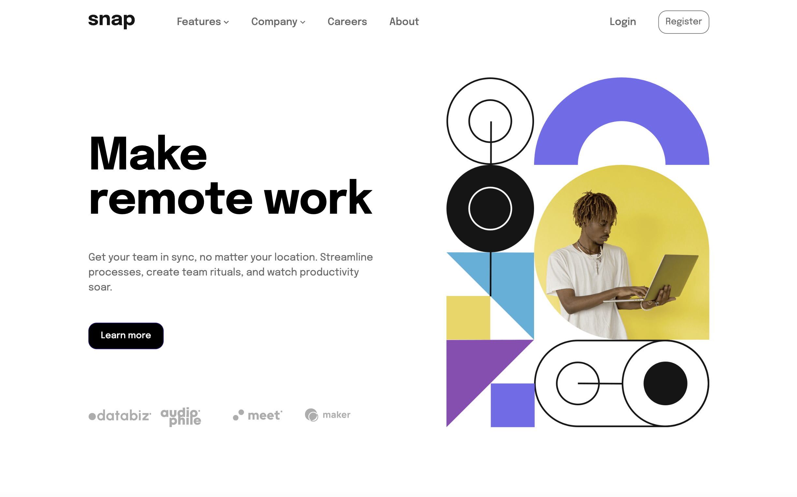

# Frontend Mentor - Intro section with dropdown navigation solution

This is a solution to the [Intro section with dropdown navigation challenge on Frontend Mentor](https://www.frontendmentor.io/challenges/intro-section-with-dropdown-navigation-ryaPetHE5). Frontend Mentor challenges help you improve your coding skills by building realistic projects.

## Table of contents

- [Overview](#overview)
  - [The challenge](#the-challenge)
  - [Screenshot](#screenshot)
  - [Links](#links)
- [My process](#my-process)
  - [Built with](#built-with)
  - [What I learned](#what-i-learned)
- [Author](#author)
- [Installation Instructions](#installation-instructions)
- [Commands](#commands)

## Overview

### The challenge

Users should be able to:

- View the relevant dropdown menus on desktop and mobile when interacting with the navigation links
- View the optimal layout for the content depending on their device's screen size
- See hover states for all interactive elements on the page

### Screenshot

### Links

- Solution URL: [Add solution URL here](https://your-solution-url.com)
- Live Site URL: [Add live site URL here](https://your-live-site-url.com)

## My process

### Built with

- Semantic HTML5 markup
- SCSS
- Flexbox
- CSS Grid
- Mobile-first workflow
- Vanilla JavaScript
- Gulp

### What I learned

Didn't learn anything new, just wanted to practice the basics again.

## Author

- Website - [Jan-Luca Splettstößer](https://www.spletti.info)
- Frontend Mentor - [@lucaspl3tti](https://www.frontendmentor.io/profile/lucaspl3tti)
- Github - [@lucaspl3tti](https://www.github.com/lucaspl3tti)

## Installation Instructions
1. Initialize a new repo from the [template repo](https://github.com/lucaspl3tti/basic-frontend-ide)
2. Clone the new repo with `git clone https://github.com/lucaspl3tti/<Repo Path>.git` to your desktop
   * use `git clone git@github.com:lucaspl3tti/<Repo Path>.git` if you are using git with ssh
4. Amend package.json file to new project and specify:
    * `name` - Name of the new project
    * `version` - Current Version of the new project
    * `description` - Description of the new project
    * `repository` - Repository Information of the new project
    * `homepage` - Link to the homepage or repo of the new project
5. Run an installation of the package dependencies using `npm i`

## Commands
`npm run dev` run this command to build the app in dev mode and initialize a dev server with hot reload.

`npm run build` run this command to simply build the app in dev mode

`npm run prod` run this command to build the app in production mode

`npm run lint:scss` run this command to lint over all scss files

`npm run lint:js` run this command to lint over all js files
